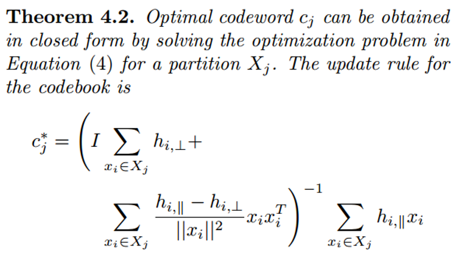
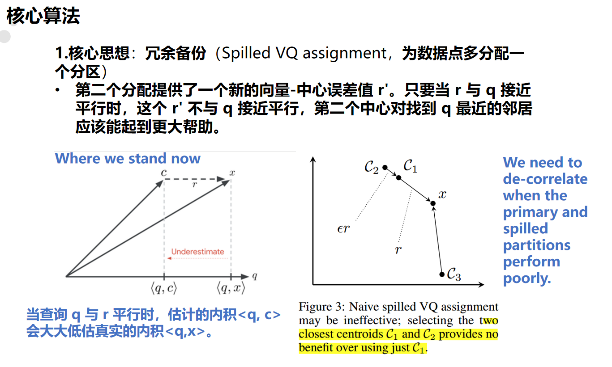

## Out-of-distribution(OOD) ANN 的TCR化。

ScaNN:Accelerating Large-Scale Inference with Anisotropic Vector Quantization(https://arxiv.org/abs/1908.10396)

SOAR:improved indexing for approximate nearest neighbor search
(https://proceedings.neurips.cc/paper_files/paper/2023/file/0973524e02a712af33325d0688ae6f49-Paper-Conference.pdf)

两种方法都属于**IVFPQ**类型。

目前在TCR上复现了ScaNN+SOAR,达到了满意的精度，需要进一步优化建索引和查询的速度。

## ScaNN:
**索引构建遵循kmeans（论文里叫向量量化,VQ）流程,但优化了中心分配和更新的loss函数,称之为Anisotropic loss。**

- 其中**分区分配的loss**从标准kmeans的最小化数据点到中心的欧式距离变成了：

**eta 乘以平行方向的误差分量的模加上垂直分量的模。** 相当于给平行方向的误差赋了一个权重，更加惩罚平行误差。

其中eta是一个关键参数，函数调用前需要normalize dataset,使得每个数据点有一样的eta值。

eta的计算：

- 中心更新采用如下公式，是求解最优化问题得到的数学解：

<mark>**总的来说 ScaNN通过采用更优的loss函数，使得索引构建的误差更小，提升了聚类的质量。**

## SOAR
主要采用冗余备份的思想，**为每个数据点分配两个中心**，当第一个中心对应分区的查询效果不够好时，第二个中心分区内的候选点作为一种补偿。**能够显著提高查询精度**。

<q,r>高的主要原因是q与r之间的夹角的cosθ高，也就是这种情况下q与r几乎平行。

**第二次分配从第一次分配已经产生的中心点里选出使loss最小的中心点，采用的loss函数如下**：

**前一项最小化量化误差的大小，第二项最优化第二个中心量化误差r'对于第一个误差r的方向，鼓励与r垂直。**

## 批量查询

单点查询的流程：
1. 求查询点和聚类中心的内积，选出内积最大的作为主中心
2. 计算查询点和主中心的残差r
3. 根据残差求次中心
4. 根据主次中心从IVF字典里取出对应两个簇中的候选点索引
5. 查询点与候选点计算内积，选出topk

**目前的批量化操作**：

1. **对于主次中心都相同的查询点，它们的候选点相同，所以可以分为一组一起做查询。每次循环处理一组查询点，减少循环次数（由查询点数量次下降到分组数量，e.g.10000->50+）**

2. **目前实现了批量取候选点的操作。可以同时取多组查询点的候选点。用类似csr的存储格式。用一个tensor按簇号顺序存储所有候选点，记录每个簇的起止位置。这样同时查询多组候选点，就相当于取出多个连续的区间。具体实现在multi-arange函数** 。

此外，由于目前的聚类结果中某些中心点组合对应的候选点数量庞大（超过50万个），
导致在计算scores = torch.matmul(group_queries, candidate_vectors.T)时，
有时候会出现OOM的情况。
目前采取的办法是**对candidate_vectors这个矩阵进行分块**，分块计算分数，最后合并取topk。解决了OOM的问题

目前实现批量查询的函数有**search_batched_chunked_matmul_mixed_precision_2unique**和**search_batched_chunked_matmul_mixed_precision_csr_newly_optimized**，两个函数去候选点的方式不同，但目前运行时间差不多。
