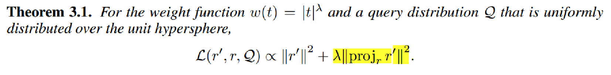

## 1.自己整理的论文main idea:
整个过程依然遵循kmeans流程：

但他们优化了中心分配和更新的loss函数：

假设 q 均匀分布在单位球面上的情况。
并非所有的 q 和 x 对都同样重要：对于 x 而言，准确量化<q1; x>的内积比<q2; x> 或 <q3; x> 更重要，
因为<q1; x>的内积更大，因此更有可能是最大值；

<q,x>=∣∣q∣∣∣∣x∣∣cos(θ)
其中，θ 是向量 q 和 x 之间的夹角。

<mark>**最终的各向异性loss是 eta 乘以平行分量加上垂直分量**。

分数感知损失函数的一个直接结果是，目标会根据点对的重要性进行权衡，从而降低对排名靠前的配对的估计误差。

## 2.google项目代码
https://github.com/google-research/google-research/tree/master/scann

anisotropic loss的核心实现在scann\partitioning\anisotropic.cc

关键参数：eta,需要normalize dataset,每个数据点才有一样的eta值。

eta求解的思路：

\scann\hashes\internal\stacked_quantizers.h：

实际他们的代码中计算的：

在ReducePartition函数里。

